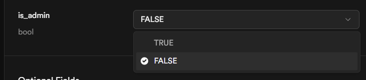

# StudySpaceV2

**An all-in-one productivity and social platform for students** with real-time communication, AI assistance, and gamified learning.

---

## 🚀 Recent Updates (v2.5)

### Collaborative Whiteboard
✅ **Real-time Drawing** - Draw together with multiple users in real-time  
✅ **Drawing Tools** - Pen, eraser, shapes (rectangle, circle, line), text, and pan tools  
✅ **Color Palette** - 10 colors to choose from (black, white, primary colors)  
✅ **Brush Sizes** - Adjustable line width from 1-50 pixels  
✅ **Live Cursors** - See where other users are drawing with color-coded cursors  
✅ **Room System** - Join different whiteboard rooms for separate projects  
✅ **Undo/Clear** - Undo your last action or clear the entire board  
✅ **Download** - Save whiteboard as PNG image  
✅ **Admin Lock** - Admins can lock/unlock whiteboard access  
✅ **Persistent Storage** - All drawings saved to Supabase with real-time sync  

### Pomodoro Timer Redesign
✅ **Circular Ring Design** - Beautiful animated progress ring showing time remaining  
✅ **Visual Modes** - Different colors for Focus (blue), Break (green), Long Break (purple)  
✅ **Mode Icons** - Brain icon for focus, coffee for breaks, clock for long breaks  
✅ **Session Dots** - Visual indicators for completed sessions  
✅ **Gradient Effects** - Modern gradients and glow effects on buttons  
✅ **Enhanced Settings** - Better organized settings panel with icons  
✅ **Mobile Responsive** - Fully optimized for all screen sizes  

### Dynamic Island Enhancement
✅ **Compact Mode** - Shows current page icon, time, and notifications  
✅ **Expanded Mode** - Reveals full navigation with smooth animations  
✅ **Live Clock** - Updates every minute with current time  
✅ **Smart Greeting** - Shows "Good Morning/Afternoon/Evening" based on time  
✅ **Notification Counter** - Shows unread notifications with pulsing badge  
✅ **Staggered Animations** - Items slide in sequentially for smooth effect  
✅ **Tooltips** - Hover to see page names on desktop  
✅ **Ambient Glow** - Subtle glow effect when expanded  
✅ **Mobile Optimized** - Reduced effects on mobile for better performance  

### Admin Panel Updates
✅ **Whiteboard Lock Control** - Lock/unlock whiteboard for all users  
✅ **Consistent UI** - Matches other admin controls  
✅ **Clear Status** - Visual feedback for lock state  

---

## 🚀 Previous Updates (v2.3)

### File Upload System for Notes & Tasks
✅ **Upload Attachments** - Attach files to notes and tasks for better organization  
✅ **Multiple Files** - Upload multiple files at once to a single note/task  
✅ **File Preview** - See selected files before creating note/task  
✅ **Download Files** - Click to download attached files directly  
✅ **File Management** - Delete attachments (creator only)  
✅ **File Icons** - Visual indicators for different file types (PDF, Word, Images, etc.)  
✅ **Supabase Storage** - Secure cloud storage with user-level access control  
✅ **Size Display** - Human-readable file sizes (KB, MB, GB)  
✅ **RLS Policies** - Row-level security for database and storage  

### UI/UX Improvements
✅ **Task Card Text** - White text on blue backgrounds for better readability  
✅ **Dialog Scrolling** - Long forms now properly scroll to show all fields  

---

## 🚀 Previous Updates (v2.2)

### Theme System Overhaul
✅ **Default Dark Theme** - Blue-based professional theme  
✅ **Forest Green Theme** - Green accent colors  
✅ **Mystical Purple Theme** - Purple accent colors  
✅ **CSS Variable System** - Inline styles with !important for guaranteed propagation  
✅ **Line Spacing** - Empty lines preserved in Notes and Tasks  
✅ **Persistent Storage** - Theme preference saved locally  

### Study Rooms - Group Video/Audio Calling
✅ **Create Study Rooms** - Start group study sessions with a unique room code  
✅ **Join by Code** - Easy access to existing rooms using a 6-digit code  
✅ **Live Video/Audio** - Real-time voice and video using WebRTC  
✅ **Participant Management** - See all active participants in the room  
✅ **Mic & Camera Controls** - Toggle audio/video on and off during sessions  
✅ **Room Chat** - Text chat alongside video for quick notes/coordination  
✅ **Participant Limit** - Set max participants when creating rooms   

### Inbox Page
✅ Scroll features for all tabs (Discover Friends, Pending Messages, Friends, Messages)  
✅ Messages tab shows "sent a message when you were away" notification  
✅ Message notifications disappear when clicked  
✅ Typing indicators with animated dots  
✅ Multiline message support (Enter to send, Shift+Enter for new line)  
✅ Proper whitespace preservation with `whitespace-pre-wrap`  
✅ Page scroll lock to prevent overflow  
✅ Real-time presence indicators  

### AI Chat Component (v1.5)
✅ Redesigned with glassmorphic style  
✅ Sparkles icon (changed from message icon)  
✅ Purple-to-pink gradient for modern look  
✅ Positioned in top right corner  
✅ Draggable window with smooth interactions  
✅ Multiline support with formatting  

### Global Updates
✅ All cards updated with glassmorphism styling  
✅ Formatting toolbar added to Notes  
✅ Formatting toolbar added to Tasks  
✅ Support for markdown in both  

### Formatting Options
✅ **Bold** - `**text**`  
✅ *Italic* - `*text*`  
✅ __Underline__ - `__text__`  
✅ Lists - `- item`  
✅ Headings - `# Heading`, `## Subheading`  
✅ Code - `` `code` ``  

---

## 🐛 Bug Fixes & Verification (v2.1)

✅ **Text Overflow Fixed** - Note content no longer overflows card boundaries  
✅ **Formatting Display Fixed** - All markdown formatting displays properly  
✅ **Subtitle Cutoff Fixed** - Subtitle text fully visible in cards  
✅ **Multi-line Support** - Text wraps correctly in all sections  
✅ **Permission System** - Creator-only delete functionality  
✅ **Layout Issues Fixed** - Better header layout with proper flex distribution  
✅ **Type Definitions** - user_id added to Note and Task interfaces  

### Previous Fixes (v2.0)
✅ **No TypeScript Errors** - All files compile successfully  
✅ **Proper Type Definitions** - All interfaces properly defined  
✅ **State Management** - Clean state handling with useCallback and useMemo  
✅ **Real-time Sync** - Supabase subscriptions working correctly  
✅ **Responsive Design** - Tested layout constraints  
✅ **Message Formatting** - Whitespace and line breaks preserved  
✅ **Error Handling** - Toast notifications for errors  
✅ **Component Refs** - Proper ref usage for scrolling and DOM manipulation  

---

## Getting Started

### 1. Clone the repository
```bash
git clone https://github.com/AyaanplayszYT/studyspaceV2.git
cd studyspaceV2
```

### 2. Install dependencies
```bash
npm install
```

### 3. Configure environment variables
Create a `.env` file in the root directory with the following:
```env
VITE_SUPABASE_URL=your_supabase_url
VITE_SUPABASE_ANON_KEY=your_supabase_anon_key
VITE_OPENROUTER_KEY=your_openrouter_api_key
```

### 4. Set up the database
- This project uses **Supabase** for authentication, database, and real-time features
- Run the SQL in `supabase/full_schema.sql` on your Supabase project
- Tables included: profiles, friendships, direct_messages, notes, tasks, settings
- Real-time subscriptions enabled for instant updates

### 5. Make yourself admin
After running the schema SQL and creating an account:
1. Go to your Supabase dashboard
2. Open the SQL Editor
3. Run this query to make yourself admin:

```sql
UPDATE public.profiles SET is_admin = true WHERE id = 'your-user-id';
```

Replace `'your-user-id'` with your actual user ID from the `profiles` table.


### SIMPLER WAY 
 1. HEAD OVER TO TABLES > PROFILES > is_admin 
 2. Click on your row and then edit table.
 3. set as TRUE


4. You can now access the Admin Panel at `/admin` to:
   - Lock/unlock Notes (only admins can post when locked)
   - Lock/unlock AI Chat (only admins can use when locked)
   - Lock/unlock General Chat (all users locked out when enabled)
   - Lock/unlock Tasks (only admins can create when locked)
   - Manage other admin users (add/remove by email)

### 6. Start the development server
```bash
npm run dev
```

The app will be available at `http://localhost:5173`

---

## 📚 Tech Stack

- **Frontend:** React + TypeScript + Tailwind CSS
- **Backend:** Supabase (PostgreSQL)
- **AI Integration:** OpenRouter API (OpenAI GPT-3.5-turbo)
- **Authentication:** Supabase Auth
- **Real-time:** Supabase Realtime
- **Markdown:** React Markdown with Syntax Highlighting
- **Icons:** Lucide React
- **Hosting:** Vercel / Netlify

---

## 🎯 Known Limitations

- AI rate-limited to 1 message per 3 seconds
- Messages stored per conversation (not globally archived)
- Admin features require direct database access to grant initial admin role

---

## Contributing

Pull requests are welcome! For major changes, please open an issue first to discuss what you would like to change.

---

## License

MIT

---

**Last Updated:** November 30, 2025  
**Version:** 2.5.0  
**Status:** Active Development
